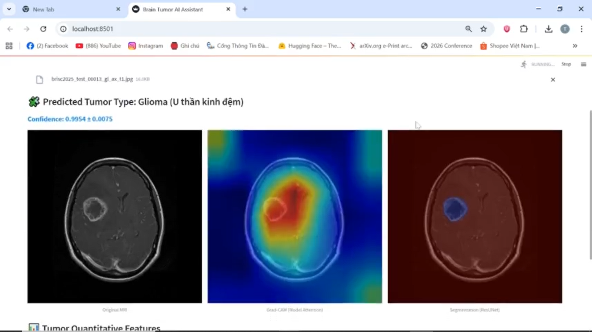
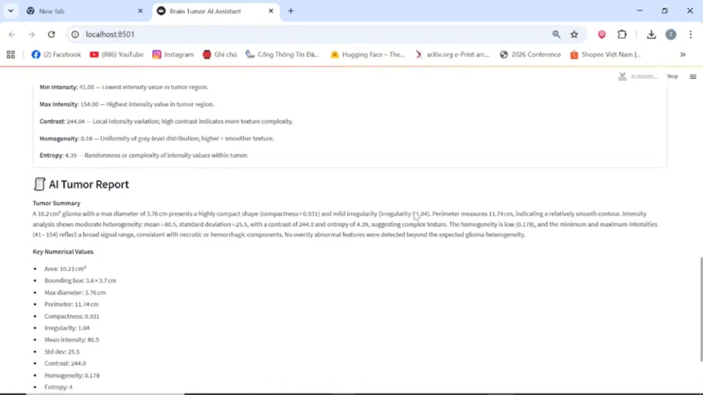

# Brain Tumor Classification & Segmentation 🧠

## Project Overview
This project implements a complete computer vision pipeline for brain tumor classification and segmentation using MRI images.

- **Classification:** Detect tumor presence using ResNet18.  
- **Segmentation:** Extract tumor regions using ResUNet with a ResNet18 encoder.  
- **Deployment:** End-to-end system ready for demo or further evaluation.  
- **Role:** Model training, preprocessing, and deployment.  
- **Achievement:** Finalist in an AI Hackathon.  

## 🔧 Technologies & Tools
- **Programming Languages:** Python  
- **Libraries:** PyTorch, torchvision, segmentation_models_pytorch, scikit-learn, numpy, pandas, matplotlib, PIL  
- **Deployment:** Streamlit  
- **Version Control:** Git, GitHub  

## 🧩 Pipeline Overview

### 1. Dataset & Loading
- MRI images and corresponding tumor masks.  
- Split into train (80%), validation (20%), and test sets.  

### 2. Preprocessing & Augmentation
- Resize images/masks to `224×224` (ResNet18) or `256×256` (ResUNet).  
- Data augmentation:
  - Horizontal/vertical flips  
  - Random rotations  
  - Color jitter (classification only)  
- Convert to tensor; round masks to 0/1.  

### 3. Model Architecture
- **ResNet18:** Classifier for tumor detection (4 classes).  
- **ResUNet:** Segmentation model with ResNet18 encoder, 1-channel output mask.  

### 4. Training
- **Loss Functions:**  
  - Classification: `CrossEntropyLoss`  
  - Segmentation: `DiceLoss` (binary)  
- **Optimizer:** Adam, `lr=1e-4`  
- **Scheduler:** ReduceLROnPlateau (classification)  
- Early stopping and model checkpointing based on validation performance.  

### 5. Evaluation & Inference
- Predict tumor class or segmentation masks for test images.  
- MC Dropout implemented for uncertainty estimation.  
- Segmentation outputs thresholded at 0.5.  

### 6. Results
ResNet18 Evaluation

<h3>ResNet18 Evaluation</h3>

<table>
  <thead>
    <tr>
      <th>Class</th>
      <th>Precision</th>
      <th>Recall</th>
      <th>F1-score</th>
      <th>Support</th>
    </tr>
  </thead>
  <tbody>
    <tr><td>glioma</td><td>0.99</td><td>0.98</td><td>0.99</td><td>254</td></tr>
    <tr><td>meningioma</td><td>0.98</td><td>0.98</td><td>0.98</td><td>306</td></tr>
    <tr><td>no_tumor</td><td>0.99</td><td>1.00</td><td>0.99</td><td>140</td></tr>
    <tr><td>pituitary</td><td>0.99</td><td>0.99</td><td>0.99</td><td>300</td></tr>
    <tr><td><b>accuracy</b></td><td></td><td></td><td><b>0.99</b></td><td><b>1000</b></td></tr>
    <tr><td>macro avg</td><td>0.99</td><td>0.99</td><td>0.99</td><td>1000</td></tr>
    <tr><td>weighted avg</td><td>0.99</td><td>0.99</td><td>0.99</td><td>1000</td></tr>
  </tbody>
</table>

### 6. Deployment
- Save best models: `best_resnet18.pth`, `best_resunet.pth`.  
- Streamlit app allows users to upload images and get predicted class and tumor mask.

## Demo Images



*Classification and Segmentation Results*



*LLM-generated Medical Report*

## 📦 Environment Setup Guide

### 1. Install Anaconda
Anaconda is recommended for managing Python environments and packages.

- **Step 1:** Download Anaconda:  
  👉 [https://www.anaconda.com/download](https://www.anaconda.com/download)  
- **Step 2:** Follow installation instructions.  
  Open Anaconda Prompt (Windows) or terminal (macOS/Linux) after installation.

### 2. Create the Conda Environment

- **Step 1:** Clone this repository
```bash
git clone https://github.com/<your-username>/<your-repo-name>.git
cd <your-repo-name>
```
- **Step 2:** Create the environment from environment.yml:
```bash
conda env create -f environment.yml
```

- **Step 3:** Activate the environment:
```bash
conda activate <env-name>
```

## 🚀 Running the Streamlit App

###1. Navigate to the project root directory

Ensure you are in the parent directory of the App/ folder:
```bash
project-root/
│
├── App/
│   └── Streamlit_Demo/
│       └── app.py
├── environment.yml
└── README.md
```

### 2. Run the app
```bash
streamlit run App/Streamlit_Demo/app.py
```
Terminal will show:
```bash
You can now view your Streamlit app in your browser.

  Local URL: http://localhost:8501
  Network URL: http://192.168.x.x:8501
```

Open the Local URL in your browser to access the app.

Stop anytime with Ctrl + C.
